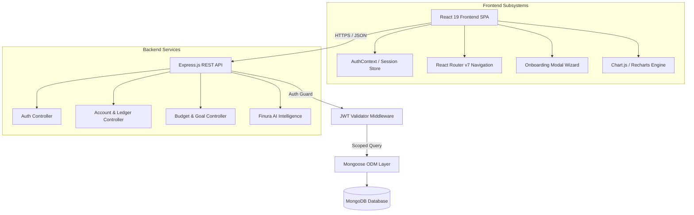

# Finura System Architecture Documentation

## 1. System Overview
Finura is built on a decoupled, micro-service-ready Single Page Application (SPA) architecture with an Express.js REST API backend and MongoDB persistence layer.

---

## 2. Directory & Component Structure

### `finura-client/`
- `src/pages/Home.jsx`: Main client-facing marketing landing page.
- `src/components/OnboardingModal.jsx`: 7-step accessible onboarding wizard for new clients.
- `src/pages/dashboard/`: Feature modules including `Overview.jsx`, `Transactions.jsx`, `Budgets.jsx`, `Goals.jsx`, `Investment.jsx`, `CreditDashboard.jsx`, `AIAssistant.jsx`, `Settings.jsx`.
- `src/context/AuthContext.jsx`: Synchronous token and user state persistence.
- `src/services/api.js`: Axios interceptor instance injecting `Bearer <token>` into request headers.

### `finura-backend/`
- `controllers/`: Business logic handlers for authentication, transactions, budgets, investments, and credit.
- `models/`: Mongoose schemas with indexed querying (`User`, `Account`, `Transaction`, `Budget`, `Goal`, `Investment`).
- `middleware/authMiddleware.js`: Bearer token validation and multi-tenant security isolation.

---

## 3. Data Flow & Security Boundary

1. **Authentication Flow**: User registers or logs in -> receives signed JWT token -> stored in browser localStorage -> attached via Axios request interceptor to subsequent HTTP requests.
2. **Tenant Isolation**: All model queries filter strictly by `{ userId: req.user.id }`. No API route allows querying data without user ownership validation.
3. **Password Security**: Passwords never enter the database in plain text. Pre-save hooks enforce 10-round bcrypt hashing.
